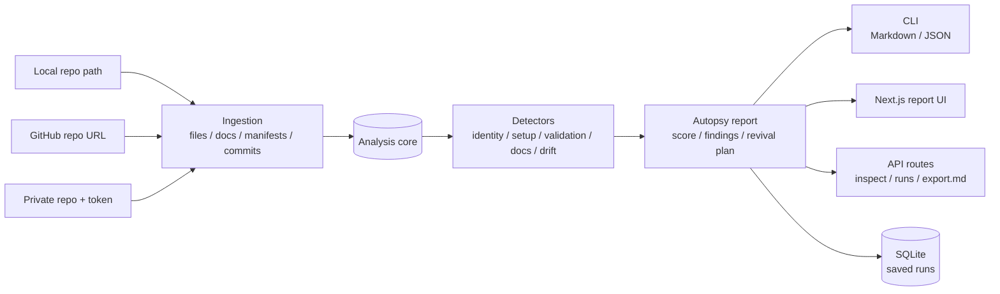
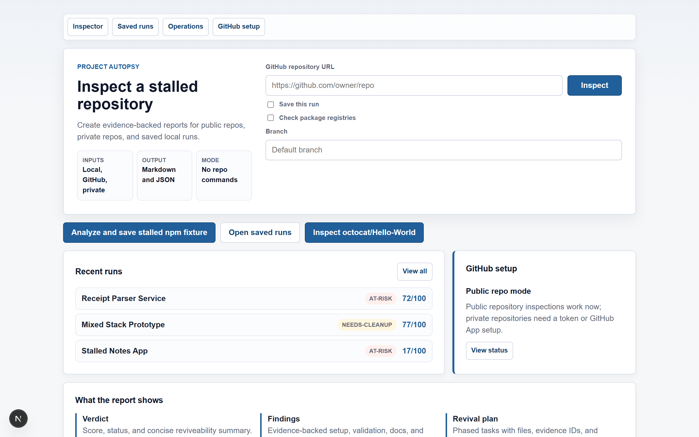
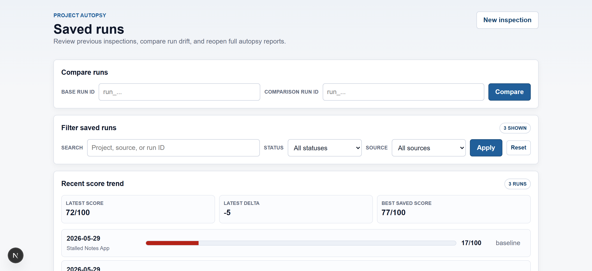
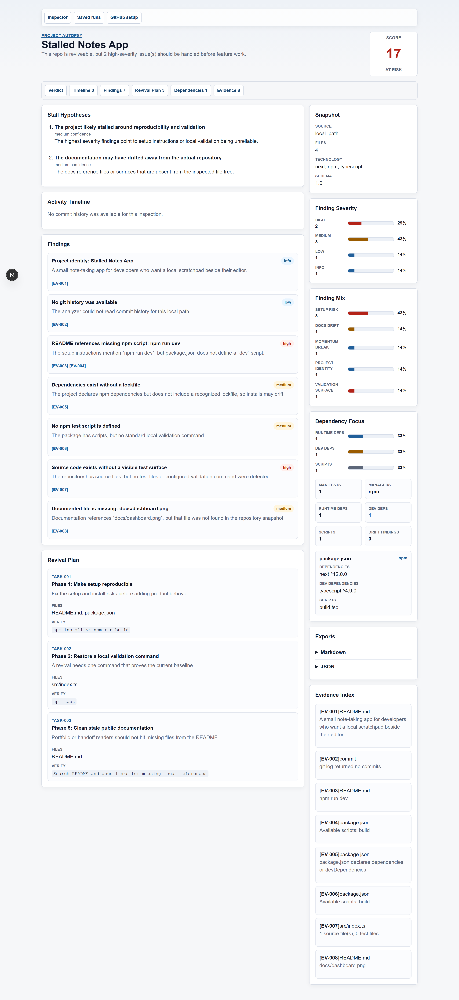
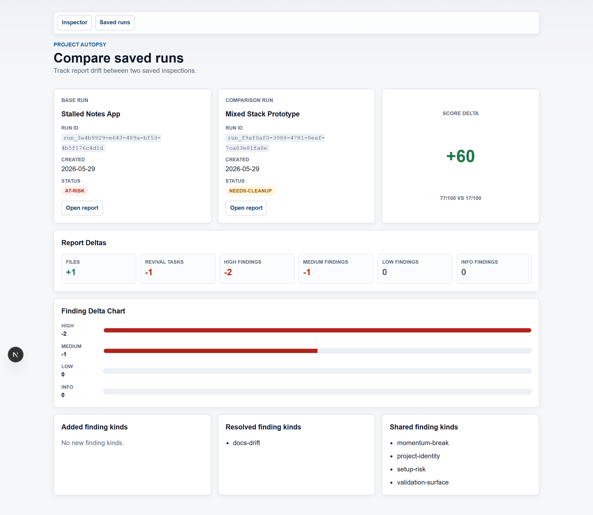

# Project Autopsy [](https://github.com/Conalh/project-autopsy/actions/workflows/ci.yml) [](.github/badges/coverage.json) [](tsconfig.base.json) [](apps/web/package.json) [](package.json) [](package.json) [](packages/core/src/store/sqlite-run-store.ts)

**An evidence-backed autopsy report for stale software repositories.** Project Autopsy inspects a local path, public GitHub URL, or token-backed private GitHub repo, then turns the file tree, manifests, docs, commit history, and dependency signals into a structured diagnosis: score, verdict, findings, stall hypotheses, revival tasks, and source evidence.

<!-- Live demo: after deploying (see DEPLOY.md), surface the URL here, e.g. **[▶ Live demo](https://project-autopsy.vercel.app)** -->

> **Local-first demo path:** `npm install` -> `npm run build` -> `npm run inspect:fixture`. The fixture report is deterministic and committed under [`docs/sample-reports`](docs/sample-reports), so report drift is reviewable.



**See also:** [sample Markdown report](docs/sample-reports/stalled-npm-app.md), [sample JSON report](docs/sample-reports/stalled-npm-app.json), and [fixtures](fixtures).

## Screenshots

Paste a repo URL (or point at a local path), and get an evidence-backed report with a verdict, ranked findings, and a revival plan.

| Inspector | Saved runs & score trend |
| --- | --- |
| [](docs/screenshots/inspector.png) | [](docs/screenshots/saved-runs.png) |

A full report — verdict and score, ranked findings with linked evidence, a phased revival plan with verification commands, and severity/dependency charts:

[](docs/screenshots/report.png)

Compare two saved inspections to track drift between runs:

[](docs/screenshots/compare.png)

> Screenshots are generated from the committed [`fixtures`](fixtures), so they reflect the deterministic sample report.

## Golden Demo

```powershell
npm install
npm run build
npm run inspect:fixture
node apps/cli/dist/index.js inspect fixtures\stalled-npm-app --format json --save
npm run web:dev
```

Then open the saved-runs page in the web app to reopen the report, filter/group saved runs, compare two saved inspections, copy a share URL, or export Markdown.

## Why This Exists

Old repos usually do not fail for mysterious reasons. They stall because setup rots, scripts disappear, dependency versions drift, docs overpromise, tests never land, or the next useful task is unclear.

Project Autopsy makes that state legible. It does not run arbitrary project commands. It reads the repository, cites what it saw, and produces the first useful revival plan:

- What was this project trying to become?
- What is actually present in the tree?
- Where are setup, validation, docs, and dependency risks?
- Which evidence supports the diagnosis?
- What should be fixed first?

## Run It

All commands run on macOS, Linux, and Windows. Examples use npm scripts and forward-slash paths (valid in PowerShell, bash, and zsh); where environment-variable or HTTP syntax genuinely differs between shells, both are shown.

### Install The Local CLI

```powershell
npm install
npm run build
npm exec -- project-autopsy inspect fixtures/stalled-npm-app --format markdown
```

The workspace exposes `project-autopsy` as a local npm bin after install. If you prefer not to use `npm exec`, call the built CLI directly:

```powershell
node apps/cli/dist/index.js --help
node apps/cli/dist/index.js inspect fixtures/stalled-npm-app --format markdown
```

### Deterministic Fixture

```powershell
npm install
npm run build
npm run inspect:fixture
npm run inspect:fixture:json
```

The fixture report comes from [`fixtures/stalled-npm-app`](fixtures/stalled-npm-app) and should match the committed samples:

```powershell
npm run samples:check
```

### Local Repository

```powershell
node apps/cli/dist/index.js inspect . --format markdown
node apps/cli/dist/index.js inspect ../some-old-repo --format json
```

### GitHub Repository

```powershell
node apps/cli/dist/index.js inspect https://github.com/octocat/Hello-World --format markdown
node apps/cli/dist/index.js inspect https://github.com/owner/repo --branch main --format markdown
```

Private repositories can be inspected with a token, passed directly:

```bash
node apps/cli/dist/index.js inspect https://github.com/owner/private-repo --github-token <token>
```

…or read from the environment:

```powershell
# PowerShell
$env:PROJECT_AUTOPSY_GITHUB_TOKEN = "<token>"
node apps/cli/dist/index.js inspect https://github.com/owner/private-repo
```

```bash
# bash / zsh
export PROJECT_AUTOPSY_GITHUB_TOKEN=<token>
node apps/cli/dist/index.js inspect https://github.com/owner/private-repo
```

The web/API surface also supports GitHub App installation tokens through environment configuration. A personal access token takes precedence when both modes are configured:

```powershell
$env:PROJECT_AUTOPSY_GITHUB_APP_ID="<app-id>"
$env:PROJECT_AUTOPSY_GITHUB_APP_SLUG="<app-slug>"
$env:PROJECT_AUTOPSY_GITHUB_APP_INSTALLATION_ID="<installation-id>"
$env:PROJECT_AUTOPSY_GITHUB_APP_CALLBACK_STATE_SECRET="<random-secret>"
$env:PROJECT_AUTOPSY_GITHUB_APP_PRIVATE_KEY_PATH="C:\path\to\github-app-private-key.pem"
```

Inline private keys are supported with `PROJECT_AUTOPSY_GITHUB_APP_PRIVATE_KEY`; escaped `\n` sequences are normalized before signing.
If your app install URL does not follow the standard slug format, set `PROJECT_AUTOPSY_GITHUB_APP_INSTALL_URL`.
When GitHub redirects back to `/api/github-app/callback?installation_id=...`, Project Autopsy stores that installation id in `.project-autopsy/github-app-installation.json` by default, or in Postgres when `PROJECT_AUTOPSY_POSTGRES_URL` or `DATABASE_URL` is configured. Override the local store path with `PROJECT_AUTOPSY_GITHUB_APP_INSTALLATION_PATH`; an explicit `PROJECT_AUTOPSY_GITHUB_APP_INSTALLATION_ID` still wins.
Set `PROJECT_AUTOPSY_GITHUB_APP_CALLBACK_STATE_SECRET` in hosted mode so install redirects include a signed `state` value and callbacks without a valid state are rejected.
Set `PROJECT_AUTOPSY_ADMIN_TOKEN` in hosted mode to protect operational views such as `/ops`. Authenticated requests can send `Authorization: Bearer <token>` or `x-project-autopsy-admin-token: <token>`.

#### Hosted Source Policy And Limits

A hosted web/API instance inspects **public github.com URLs only** by default. Local filesystem inspection (which can read arbitrary server paths) is disabled unless you explicitly opt in for local development:

```powershell
$env:PROJECT_AUTOPSY_ALLOW_LOCAL_PATHS="true"   # development only; never set on a public deployment
```

`POST /api/repositories/inspect` is rate limited per client (`PROJECT_AUTOPSY_INSPECT_RATE_LIMIT`, default `60` per window; `PROJECT_AUTOPSY_INSPECT_RATE_WINDOW_SECONDS`, default `60`; set the limit to `0` to disable). It can also require a token via `PROJECT_AUTOPSY_INSPECT_TOKEN`, sent as `Authorization: Bearer <token>` or `x-project-autopsy-inspect-token: <token>`.

For absolute share links, set a trusted base URL with `PROJECT_AUTOPSY_PUBLIC_URL` (preferred), or allow-list proxy hosts with `PROJECT_AUTOPSY_ALLOWED_HOSTS` (comma-separated). When neither is configured, forwarded `Host`/`X-Forwarded-Host` headers are not trusted and share links fall back to relative paths.

### Dependency Freshness

Registry checks are opt-in. They currently query npm, PyPI, and crates.io, then compare declared package ranges against each registry's latest published version.

```powershell
node apps/cli/dist/index.js inspect . --format markdown --check-registry
```

Registry failures become informational findings instead of blocking the report.

### Saved Runs

```powershell
node apps/cli/dist/index.js inspect . --format json --save
node apps/cli/dist/index.js runs
node apps/cli/dist/index.js show <run_id> --format markdown
```

Saved runs live in `.project-autopsy/runs.sqlite` by default and are ignored by git.

The web saved-runs page adds filtering, project/source grouping, score trend visualization, share links, and pairwise comparisons.

Hosted web/API runs can use Postgres by setting `PROJECT_AUTOPSY_POSTGRES_URL` or `DATABASE_URL`. When neither is present, the web surface falls back to SQLite. `PROJECT_AUTOPSY_RUN_DB_PATH` can override the local SQLite path.
Queued hosted jobs persist payload, status, result, error, and retry attempts in Postgres. Set `PROJECT_AUTOPSY_ANALYSIS_JOB_MAX_ATTEMPTS` to retry transient queued-analysis failures before a job is marked failed. Set `PROJECT_AUTOPSY_ANALYSIS_QUEUE_MODE=external` when a separate worker process will claim and process queued jobs through `processNextAnalysisJob`.
Schedulers can trigger bounded external-worker batches through `POST /api/worker/run` with an optional JSON body such as `{ "maxJobs": 5, "cleanupTerminalJobsOlderThan": "2026-05-20T00:00:00.000Z" }`.

## Web And API

Start the Next.js app:

```powershell
npm run web:dev
```

To host it publicly, see [DEPLOY.md](DEPLOY.md) — hosted mode inspects public GitHub URLs only by default, so it is safe to deploy.

The first screen is the inspector: paste a GitHub URL, optionally save the run, optionally check registry freshness, then open the report. Saved reports can be reopened, filtered, grouped, shared, compared, and exported from the web UI.

The same report contract is exposed through local API routes:

```bash
# bash / zsh
curl -s http://127.0.0.1:3000/api/repositories/inspect \
  -H "content-type: application/json" \
  -d '{"source":"https://github.com/owner/repo","save":true}'
```

```powershell
# PowerShell
Invoke-RestMethod `
  -Method Post `
  -Uri http://127.0.0.1:3000/api/repositories/inspect `
  -ContentType "application/json" `
  -Body '{"source":"https://github.com/owner/repo","save":true}'
```

| Route | Purpose |
| --- | --- |
| `POST /api/repositories/inspect` | Inspect a local path or GitHub URL and return `{ report }` or `{ run, report }` |
| `POST /api/repositories/inspect` with `{ "queue": true }` | Queue an inspection and return `{ job }` with HTTP `202` |
| `GET /api/github-app/status` | Show PAT/GitHub App setup state and missing env fields |
| `GET /api/github-app/install` | Redirect to the configured GitHub App installation URL |
| `GET /api/github-app/callback` | Persist the GitHub App `installation_id` callback for future API auth |
| `GET /api/jobs/{id}` | Poll an in-process queued inspection job |
| `POST /api/worker/run` | Run a bounded external worker batch for scheduler-triggered hosted processing |
| `GET /ops` | View queue storage mode, health alerts, job status counts, and recent analysis jobs; guarded by `PROJECT_AUTOPSY_ADMIN_TOKEN` when configured |
| `GET /api/runs/{id}` | Load a saved run as JSON |
| `GET /api/runs/{id}/export.md` | Load a saved run as Markdown |
| `GET /share/{id}` | Open a read-only share view for a saved run |
| `GET /compare?left={run_id}&right={run_id}` | Compare two saved runs by score, files, tasks, severity counts, and finding kinds |

## What The Report Contains

```markdown
# Project Autopsy: Stalled Notes App

## Verdict

**Score:** 17/100
**Status:** at-risk

## Top Findings

- FINDING-003: README references missing npm script: npm run dev
- FINDING-006: Source code exists without a visible test surface

## Activity Timeline

- 2026-05-27 latest visible commit

## Dependency Focus

- Manifests: 1
- Managers: npm

## Revival Plan

- TASK-001: Phase 1: Make setup reproducible
- TASK-002: Phase 2: Restore a local validation command

## Evidence Index

- [EV-003] README.md - npm run dev
```

The real report also includes a project snapshot, dependency snapshot, ranked stall hypotheses, evidence IDs, expected outcomes, and verification commands. Markdown exports include a recent activity timeline and dependency focus rollup so handoff readers can scan momentum and package surface before diving into raw findings.

## Analysis Model

The core package produces a normalized `RepoSnapshot` first, then runs detectors over that snapshot. All report surfaces consume the same `AutopsyReport` object.

| Detector | Signals |
| --- | --- |
| Project identity | README title, first purpose paragraph, package metadata |
| Momentum break | Last visible commit when local git history or GitHub commits are available |
| Setup risk | README commands, package scripts, lockfiles, missing test script |
| Validation surface | Source files, test files, CI/workflow hints |
| Docs drift | Referenced local files that do not exist in the snapshot |
| Dependency drift | Opt-in npm, PyPI, and crates.io latest-major checks |

Every finding carries evidence. Evidence is promoted into a report-wide index, then findings and revival tasks reference it by stable IDs.

## Manifest Coverage

| Ecosystem | Files |
| --- | --- |
| npm | `package.json` |
| Python | `pyproject.toml`, `requirements.txt` |
| Rust | `Cargo.toml` |
| Go | `go.mod` |
| .NET | `.csproj`, `.sln` detection; `.csproj` package references |

Parsed dependencies appear in the dependency snapshot. Registry freshness currently checks npm, PyPI, and crates.io only.

## Package Map

```text
apps/
  cli/              Node CLI wrapper around the core
  web/              Next.js UI and API routes
packages/
  core/             Ingestion, detectors, report assembly, Markdown/JSON, SQLite/Postgres stores
fixtures/           Stable local repositories for deterministic tests and samples
docs/sample-reports/  Committed regression artifacts
```

The core owns product behavior. CLI, web pages, and API routes are thin surfaces over the same report contract.

## Tests

```powershell
npm test
npm run build
npm run coverage
npm run coverage:badge
npm run samples:check
npm run package:check
```

The GitHub Actions workflow in [`.github/workflows/ci.yml`](.github/workflows/ci.yml) runs the same build, test, coverage, coverage-badge drift, sample-report drift, and package-surface checks on pushes, pull requests, and manual dispatches. Coverage reports are uploaded as a CI artifact, and the public README badge is backed by [`.github/badges/coverage.json`](.github/badges/coverage.json).

Current coverage focus:

- Core ingestion, detectors, report schema, persistence, manifest parsing, dependency drift, and sample report drift.
- CLI behavior for local paths, public GitHub, private token flow, save/list/show, and registry checks.
- Web API route behavior for inspect, saved run JSON, Markdown export, request validation, report charts, saved-run trends, and saved-run filters.

## Package Surface

`npm run package:check` builds the workspace, runs `npm pack --dry-run --json` for `@project-autopsy/core` and `@project-autopsy/cli`, and fails if package tarballs include source folders, test folders, or TypeScript config files. This keeps the installable surface limited to compiled `dist` output and package metadata.

The CLI package still depends on the local workspace core package during development. Treat the current package check as publish-surface readiness, not an npm release command.

## Status

Project Autopsy is a local-first portfolio/devtool slice. What works today:

- **One core, three surfaces.** Local and GitHub ingestion feed a single normalized snapshot and `AutopsyReport`, consumed identically by the CLI, the Next.js web UI, and the API routes.
- **Reports.** Score, verdict, evidence-linked findings, stall hypotheses, and a phased revival plan — exported as Markdown or JSON.
- **Saved runs.** SQLite by default (Postgres in hosted mode), with browsing, filtering, score trends, share links, and pairwise comparison in the web UI.
- **GitHub auth.** Public repos, or private repos via a personal access token or GitHub App installation token.
- **Hosted ops.** Queued inspections with job polling, bounded external-worker batches, an operations dashboard, and admin-token-gated operational views.
- **Hosted safety.** Public deployments inspect github.com URLs only by default; `/api/repositories/inspect` is rate-limited and supports an optional access token (see [Hosted Source Policy And Limits](#hosted-source-policy-and-limits)).
- **Quality gates.** CI runs build, tests, coverage + badge drift, sample-report drift, and package-surface checks; sample reports are committed and regression-checked.

Limits worth knowing:

- Hosted mode is GitHub-URL-only by default with per-client rate limiting; richer multi-tenant auth is future work.
- Registry freshness is npm/PyPI/crates.io-only and opt-in.
- The analyzer never executes inspected repository commands.
- GitHub App callback persistence uses local ignored storage by default and Postgres in hosted mode.
- npm publication, saved-run bulk actions, retention controls, and broader production auth are future work.

## Roadmap

1. Saved-run bulk actions and retention controls.
2. npm release decision: package names, dependency strategy, license, and versioning.
3. Registry-backed drift checks for Go and .NET.
4. Coverage threshold policy and package-level coverage notes.
5. Broader production auth and deployment hardening.

## License

[MIT](LICENSE) &copy; 2026 Conal Hickey
