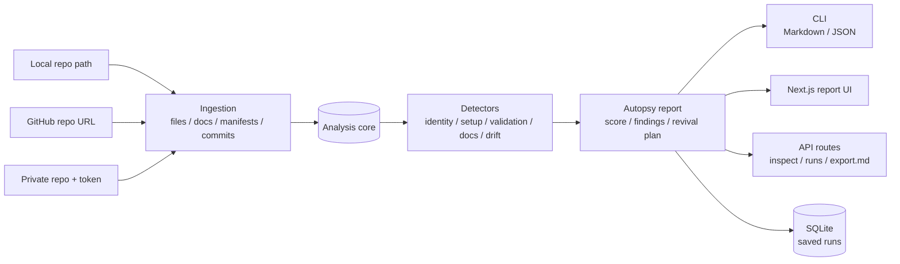

# Project Autopsy [](https://github.com/Conalh/project-autopsy/actions/workflows/ci.yml) [](tsconfig.base.json) [](apps/web/package.json) [](package.json) [](package.json) [](packages/core/src/store/sqlite-run-store.ts)

**An evidence-backed autopsy report for stale software repositories.** Project Autopsy inspects a local path, public GitHub URL, or token-backed private GitHub repo, then turns the file tree, manifests, docs, commit history, and dependency signals into a structured diagnosis: score, verdict, findings, stall hypotheses, revival tasks, and source evidence.

> **Local-first demo path:** `npm install` -> `npm run build` -> `npm run inspect:fixture`. The fixture report is deterministic and committed under [`docs/sample-reports`](docs/sample-reports), so report drift is reviewable.



**See also:** [sample Markdown report](docs/sample-reports/stalled-npm-app.md) / [sample JSON report](docs/sample-reports/stalled-npm-app.json) / [fixtures](fixtures)

## Why This Exists

Old repos usually do not fail for mysterious reasons. They stall because setup rots, scripts disappear, dependency versions drift, docs overpromise, tests never land, or the next useful task is unclear.

Project Autopsy makes that state legible. It does not run arbitrary project commands. It reads the repository, cites what it saw, and produces the first useful revival plan:

- What was this project trying to become?
- What is actually present in the tree?
- Where are setup, validation, docs, and dependency risks?
- Which evidence supports the diagnosis?
- What should be fixed first?

## Run It

### Install The Local CLI

```powershell
npm install
npm run build
npm exec -- project-autopsy inspect fixtures/stalled-npm-app --format markdown
```

The workspace exposes `project-autopsy` as a local npm bin after install. If you prefer not to use `npm exec`, call the built CLI directly:

```powershell
node apps\cli\dist\index.js inspect fixtures\stalled-npm-app --format markdown
```

### Deterministic Fixture

```powershell
npm install
npm run build
npm run inspect:fixture
npm run inspect:fixture:json
```

The fixture report comes from [`fixtures/stalled-npm-app`](fixtures/stalled-npm-app) and should match the committed samples:

```powershell
npm run samples:check
```

### Local Repository

```powershell
node apps\cli\dist\index.js inspect . --format markdown
node apps\cli\dist\index.js inspect C:\path\to\old-repo --format json
```

### GitHub Repository

```powershell
node apps\cli\dist\index.js inspect https://github.com/octocat/Hello-World --format markdown
node apps\cli\dist\index.js inspect https://github.com/owner/repo --branch main --format markdown
```

Private repositories can be inspected with a token:

```powershell
node apps\cli\dist\index.js inspect https://github.com/owner/private-repo --github-token <token>

$env:PROJECT_AUTOPSY_GITHUB_TOKEN="<token>"
node apps\cli\dist\index.js inspect https://github.com/owner/private-repo
```

### Dependency Freshness

Registry checks are opt-in. Today they query npm only and compare declared package ranges against the registry `latest` dist-tag.

```powershell
node apps\cli\dist\index.js inspect . --format markdown --check-registry
```

Registry failures become informational findings instead of blocking the report.

### Saved Runs

```powershell
node apps\cli\dist\index.js inspect . --format json --save
node apps\cli\dist\index.js runs
node apps\cli\dist\index.js show <run_id> --format markdown
```

Saved runs live in `.project-autopsy/runs.sqlite` by default and are ignored by git.

## Web And API

Start the Next.js app:

```powershell
npm run web:dev
```

The first screen is the inspector: paste a GitHub URL, optionally save the run, optionally check npm registry freshness, then open the report.

The same report contract is exposed through local API routes:

```powershell
Invoke-RestMethod `
  -Method Post `
  -Uri http://127.0.0.1:3000/api/repositories/inspect `
  -ContentType "application/json" `
  -Body '{"source":"https://github.com/owner/repo","save":true}'
```

| Route | Purpose |
| --- | --- |
| `POST /api/repositories/inspect` | Inspect a local path or GitHub URL and return `{ report }` or `{ run, report }` |
| `GET /api/runs/{id}` | Load a saved run as JSON |
| `GET /api/runs/{id}/export.md` | Load a saved run as Markdown |

## What The Report Contains

```markdown
# Project Autopsy: Stalled Notes App

## Verdict

**Score:** 17/100
**Status:** at-risk

## Top Findings

- FINDING-003: README references missing npm script: npm run dev
- FINDING-006: Source code exists without a visible test surface

## Revival Plan

- TASK-001: Phase 1: Make setup reproducible
- TASK-002: Phase 2: Restore a local validation command

## Evidence Index

- [EV-003] README.md - npm run dev
```

The real report also includes a project snapshot, dependency snapshot, ranked stall hypotheses, evidence IDs, expected outcomes, and verification commands.

## Analysis Model

The core package produces a normalized `RepoSnapshot` first, then runs detectors over that snapshot. All report surfaces consume the same `AutopsyReport` object.

| Detector | Signals |
| --- | --- |
| Project identity | README title, first purpose paragraph, package metadata |
| Momentum break | Last visible commit when local git history or GitHub commits are available |
| Setup risk | README commands, package scripts, lockfiles, missing test script |
| Validation surface | Source files, test files, CI/workflow hints |
| Docs drift | Referenced local files that do not exist in the snapshot |
| Dependency drift | Opt-in npm registry latest-major checks |

Every finding carries evidence. Evidence is promoted into a report-wide index, then findings and revival tasks reference it by stable IDs.

## Manifest Coverage

| Ecosystem | Files |
| --- | --- |
| npm | `package.json` |
| Python | `pyproject.toml`, `requirements.txt` |
| Rust | `Cargo.toml` |
| Go | `go.mod` |
| .NET | `.csproj`, `.sln` detection; `.csproj` package references |

Parsed dependencies appear in the dependency snapshot. Non-npm registry freshness is intentionally not claimed yet.

## Package Map

```text
apps/
  cli/              Node CLI wrapper around the core
  web/              Next.js UI and API routes
packages/
  core/             Ingestion, detectors, report assembly, Markdown/JSON, SQLite store
fixtures/           Stable local repositories for deterministic tests and samples
docs/sample-reports/  Committed regression artifacts
```

The core owns product behavior. CLI, web pages, and API routes are thin surfaces over the same report contract.

## Tests

```powershell
npm test
npm run build
npm run samples:check
```

The GitHub Actions workflow in [`.github/workflows/ci.yml`](.github/workflows/ci.yml) runs the same build, test, and sample-report drift checks on pushes, pull requests, and manual dispatches.

Current coverage focus:

- Core ingestion, detectors, report schema, persistence, manifest parsing, dependency drift, and sample report drift.
- CLI behavior for local paths, public GitHub, private token flow, save/list/show, and registry checks.
- Web API route behavior for inspect, saved run JSON, Markdown export, and request validation.

## Status

Project Autopsy is currently a local-first portfolio/devtool slice:

- Local and GitHub ingestion share one normalized snapshot pipeline.
- Private GitHub repos work with a supplied token.
- Reports export as Markdown and JSON.
- Saved run history is backed by local SQLite.
- Web and API routes reuse the same core package.
- Sample reports are committed and regression-checked.

Limits worth knowing:

- Hosted API mode is local-first and file-backed; production auth, queues, and Postgres are future work.
- Registry freshness is npm-only and opt-in.
- The analyzer never executes inspected repository commands.
- Full GitHub App installation is not implemented yet.
- Web UI polish is intentionally behind the core/report contract.

## Roadmap

1. Report polish for timeline and dependency-focused views.
2. Registry-backed drift checks beyond npm.
3. Coverage and badge polish for the public GitHub surface.
4. GitHub App installation for hosted/private repo access.
5. Hosted queues and Postgres-backed run storage.
